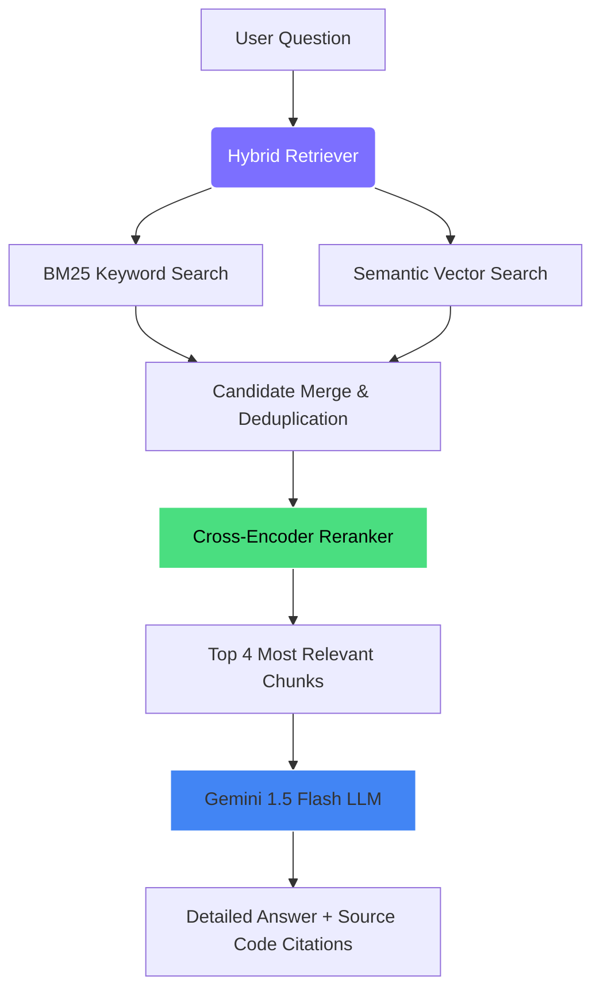

# Gitty — Local Codebase QA Assistant

[](https://www.python.org/)
[](https://fastapi.tiangolo.com/)
[](https://aistudio.google.com/)
[](https://www.trychroma.com/)

Gitty is a lightweight RAG (Retrieval-Augmented Generation) application designed to search and analyze local source code folders or cloned repositories using Gemini. It parses directory files, indexes their contents locally, and answers functional queries about the codebase with code citations.

---

## Showcase & User Interface

Here is a visual walkthrough of Gitty in action:

### 1. Initial State
When first opened, Gitty presents a clean interface. It validates server availability, displays suggestion queries, and indicates connectivity status.


### 2. Codebase Indexing
Enter the path of any local repository folder. Gitty traverses directories, filters out binary/build files, chunks source files, generates embeddings, and saves them to a local vector store.


### 3. High-Level Summary Queries
Submit overview questions (e.g. *"describe the structure"* or *"explain what this project does"*). Gitty aggregates details and displays the source files referenced.


### 4. Technical Architecture Questions
Ask architecture-specific details. In the example below, Gitty outlines real-time coordination handlers.


### 5. Detailed Workflows
Ask questions about control flow across multiple modules to receive step-by-step logic and file references.


---

## Architecture & Search Pipeline

Gitty combines keyword search and semantic vector search in a hybrid retrieval pipeline.



1. **File Parser:** Scans directory structure for text-based code files (Python, JS, TS, React, HTML, CSS, C++, Go, Rust, etc.). Files and directories specified in standard ignores (like `.git`, `node_modules`, `venv`) are bypassed.
2. **Text Chunking:** Splits file contents using LangChain's `RecursiveCharacterTextSplitter` into 800-character segments with 80-character overlap.
3. **Embeddings:** Generates vector representations locally via `sentence-transformers/all-MiniLM-L6-v2` on CPU.
4. **Retrieval Search:** Performs parallel query matching:
   * **Semantic Search:** Matches conceptual similarity using Chroma DB.
   * **Keyword Search:** Matches exact identifiers and variable occurrences using a BM25 index.
5. **Reranker:** Ranks merged search results via `cross-encoder/ms-marco-MiniLM-L-6-v2` and selects the top 4 candidates.
6. **Gemini LLM:** Prompts **Gemini 1.5 Flash** with the top retrieved code chunks to compile a structured answer.

---

## Setup & Quick Start

### Prerequisites
*   **Python 3.11** (Recommended)
*   **Gemini API Key** (Accessible from [Google AI Studio](https://aistudio.google.com/app/apikey))

### 1. Installation
Clone the repository and install requirements in a virtual environment:

```bash
# Create virtual environment
python -m venv venv

# Activate virtual environment
# Windows:
.\venv\Scripts\Activate.ps1
# Mac/Linux:
source venv/bin/activate

# Install dependencies
pip install -r requirements.txt
```

### 2. Environment Variables
Create a `.env` file in the root directory:

```env
GEMINI_API_KEY=AIzaSyYourGeminiApiKeyHere
GEMINI_MODEL=gemini-1.5-flash
ANON_TELEMETRY=False
```

### 3. Start Backend Server
Launch the application:
```bash
python main.py
```

### 4. Access UI
Open **`frontend/index.html`** directly in a web browser.

---

## API Documentation

FastAPI provides endpoint documentation at `http://localhost:8000/docs`.

| Endpoint | Method | Purpose | Payload / Response |
| :--- | :---: | :--- | :--- |
| `/health` | `GET` | Return server availability status | Connection indicators and cached chunk metrics |
| `/index` | `POST` | Wipe existing DB store and index directory | `{"folder_path": "/path/to/project"}` |
| `/ask` | `POST` | Retrieve context and answer query | `{"query": "Query text here"}` |
| `/status` | `GET` | Return current indexed path metrics | Folder name and total chunks count |

---

## Directory Structure

```text
gitty/
├── backend/
│   ├── __init__.py
│   ├── api.py           # FastAPI Web Server (exposes routes & starts server)
│   └── rag_engine.py    # Core RAG logic (parsing, chunking, retrieval, Gemini call)
├── frontend/
│   └── index.html       # Glassmorphism Browser UI
├── assets/
│   └── .gitkeep         # Stores screenshots for the README
├── .env                 # Environment config (API key, model)
├── .gitignore           # Git ignore rules (ignores .env, venv/, and chroma_db/)
├── requirements.txt     # Python dependencies
├── main.py              # Entry point to load env and launch server
└── README.md            # This documentation file
```

---

## License
MIT License.
